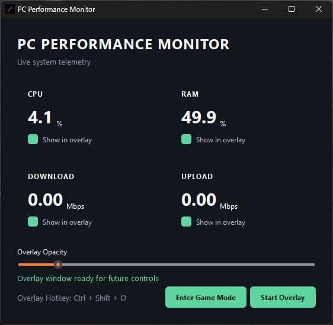
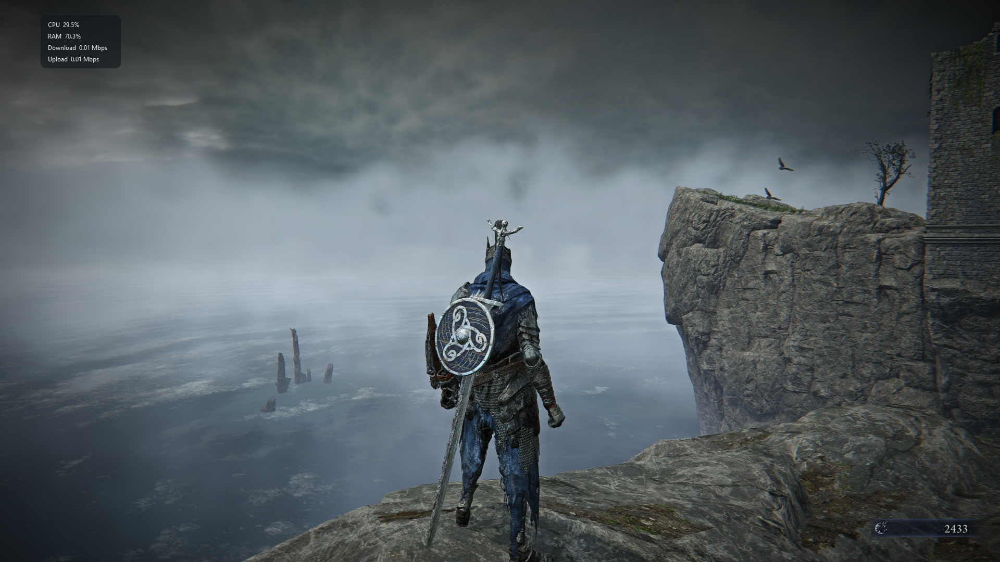

# PC Performance Monitor

A lightweight Windows desktop application for monitoring real-time system performance with a customizable in-game overlay.

The application is built with Python and PySide6 and currently tracks CPU usage, RAM usage, and network activity while providing a draggable, transparent overlay that can stay visible above other applications.

## Screenshots

### Dashboard



### Performance Overlay




## Features

* Real-time CPU usage monitoring
* Real-time RAM usage monitoring
* Network download speed monitoring
* Network upload speed monitoring
* Modern dark-themed dashboard
* Selectable overlay metrics
* Always-on-top performance overlay
* Frameless overlay window
* Transparent overlay background
* Adjustable overlay background opacity
* Click-through Game Mode
* Draggable Edit Mode
* Saved overlay position
* Saved opacity settings
* Global `Ctrl + Shift + O` hotkey to show or hide the overlay

## Overlay Compatibility

The performance overlay is designed to display system metrics over normal desktop applications and games running in **Windowed** or **Borderless Windowed** mode.

### Currently Supported

* Standard desktop applications
* Windowed games
* Borderless windowed games
* Always-on-top overlay display
* Click-through Game Mode

### Exclusive Fullscreen

The overlay may not appear over games running in **Exclusive Fullscreen** mode.

The current overlay is implemented as a lightweight Windows/Qt always-on-top window. Exclusive fullscreen applications can bypass normal desktop window composition, preventing standard overlay windows from being displayed above the game.

For the best experience, use **Borderless Windowed** mode when available.

Native exclusive-fullscreen overlay support is being considered for a future version.


## Overlay Modes

### Edit Mode

Edit Mode allows the overlay to receive mouse input.

While in Edit Mode, the overlay can be dragged to a preferred location on the screen.

### Game Mode

Game Mode makes the overlay click-through.

Mouse input passes through the overlay to the game or application underneath it while the performance information remains visible.

## Hotkey

Use:

```text
Ctrl + Shift + O
```

to globally show or hide the overlay.

The hotkey works even when the PC Performance Monitor dashboard is not the active window.

## Technologies

* Python
* PySide6
* psutil
* Windows API
* QSettings

## Project Structure

```text
Pc performance monitor/
│
├── main.py
├── gui.py
├── monitor.py
├── requirements.txt
├── README.md
└── .gitignore
```

### `main.py`

Starts the PySide6 application, applies the global application styling, creates the system monitor, and launches the dashboard.

### `gui.py`

Contains the dashboard interface, metric cards, overlay window, opacity controls, overlay positioning, Game/Edit modes, and global hotkey behavior.

### `monitor.py`

Handles system performance collection and calculations independently from the GUI.

## Installation

Clone the repository:

```bash
git clone https://github.com/xYeasYx/Pc-performance-monitor.git
```

Move into the project directory:

```bash
cd Pc-performance-monitor
```

Create a virtual environment:

```bash
python -m venv .venv
```

Activate it on Windows PowerShell:

```powershell
.\.venv\Scripts\Activate.ps1
```

Install the required packages:

```bash
pip install -r requirements.txt
```

## Running the Application

With the virtual environment activated:

```bash
python main.py
```

## How Network Monitoring Works

The application uses system network counters to measure how much data is received and transmitted between samples.

The displayed download and upload values represent the computer's current network traffic rather than the maximum speed of the internet connection.

## Persistent Settings

The application uses Qt's `QSettings` system to remember user preferences between sessions.

Currently saved settings include:

* Overlay X position
* Overlay Y position
* Overlay opacity

If a previously saved overlay position is no longer valid because of a monitor or resolution change, the application can fall back to a default visible position.

## Current Status

The main monitoring dashboard and overlay system are functional.

Current overlay features include:

* Live updates
* Selected metric display
* Transparency
* Adjustable opacity
* Draggable positioning
* Position persistence
* Click-through Game Mode
* Edit Mode
* Global overlay hotkey

## Planned Features

Future improvements may include:

* GPU usage monitoring
* CPU and GPU temperature monitoring
* FPS monitoring
* Manual internet speed test
* Additional overlay customization
* User-configurable hotkeys
* Improved multi-monitor handling
* System tray support
* Historical performance graphs
* Packaged Windows executable

## Purpose

This project is being developed as both a practical PC monitoring utility and a portfolio project focused on:

* Python application development
* Desktop GUI development
* System monitoring
* Windows APIs
* Real-time data collection
* Application state persistence
* Clean separation between monitoring logic and user interface code

## License

This project is currently intended for personal and portfolio use.
